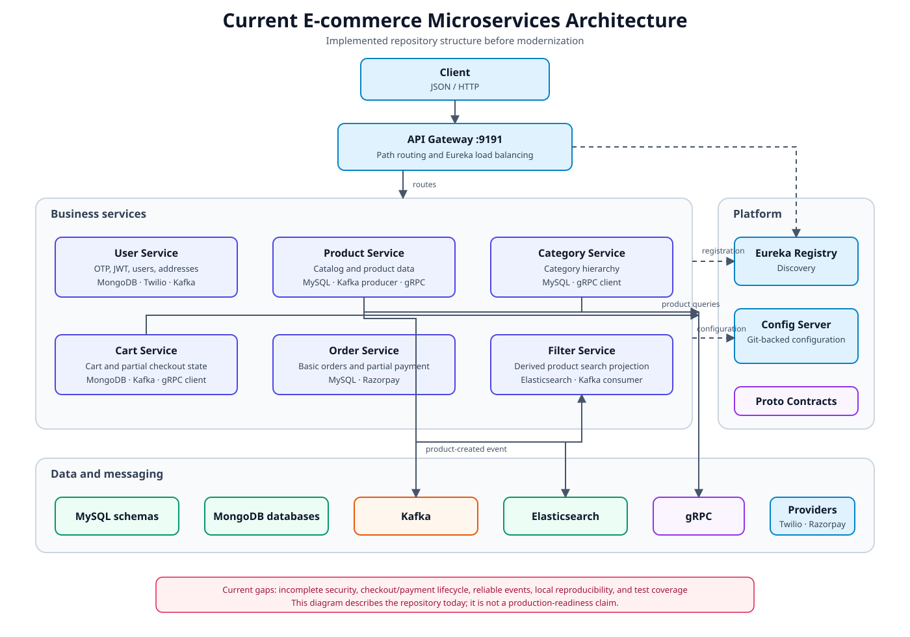

# E-commerce Microservices

This repository is being evolved from a legacy Spring microservice prototype into
a production-oriented e-commerce backend deployed on AWS. The current code does
not yet implement the production design.

[Production Target Architecture](docs/architecture/target-architecture.md) is the
architectural source of truth. [Current Architecture](docs/architecture/current-architecture.md)
describes the legacy implementation only. Rationale is recorded in
[Architecture Decision Records](docs/adr/README.md).

## Production direction

- Java 21 with a current compatible supported Spring Boot 3.x baseline; exact
  framework versions are selected during the runtime upgrade.
- Amazon EKS/Kubernetes and ECR, provisioned through Terraform.
- Product and Category consolidate into Catalog on Aurora PostgreSQL.
- Pricing is an independent bounded context, initially isolated within Catalog.
- Customer Profile, Inventory, Order and Payment own separate transactional
  boundaries on Aurora PostgreSQL.
- Cart owns customer cart intent only and targets DynamoDB.
- Search is a rebuildable OpenSearch projection; product media uses S3/CloudFront.
- Order owns the checkout Saga. SQS/DLQs carry point-to-point commands; MSK/Kafka
  carries durable domain facts for replay and fan-out.
- Transactional Outbox/Inbox and idempotent consumers provide database/message
  reliability. The system does not claim exactly-once business processing.
- Cognito/OIDC replaces custom authentication direction. Secrets Manager holds
  secrets; Parameter Store/ConfigMaps hold non-secret configuration.
- GitHub Actions creates verified artifacts; Argo CD GitOps promotes them to
  production. CloudWatch with OpenTelemetry/X-Ray provides core observability.

Non-production AWS environments may use cheaper capacity and reduced redundancy,
but must preserve production application boundaries, contracts and correctness.

## Reference checkout flow

```text
Cart snapshot
  -> authoritative Pricing
  -> PENDING Order + Saga/outbox
  -> ReserveInventory
  -> InventoryReserved | InventoryRejected
  -> AuthorizePayment
  -> confirm/reject Order
  -> compensate Payment/Inventory when required
  -> OrderConfirmed
  -> asynchronous downstream consumers
```

Payment authorization and capture are separate lifecycle operations. Capture
timing follows fulfillment and business policy rather than being performed
blindly during checkout.

## Legacy repository state



The Maven reactor currently contains ten modules:

| Module | Legacy responsibility |
| --- | --- |
| `user-service` | OTP/JWT authentication, users, customers and addresses |
| `product-service` | Products, prices, discounts, tax, images and quantity |
| `category-service` | Category hierarchy |
| `cart-service` | Carts plus incomplete checkout/payment state |
| `order-service` | Basic order persistence and incomplete provider payment initiation |
| `filter-service` | Elasticsearch product projection |
| `api-gateway` | Eureka-backed path routing |
| `service-registry` | Eureka discovery |
| `cloud-config-server` | Git-backed Spring Cloud Config |
| `proto` | Shared Product gRPC contract |

The legacy implementation uses Java 17, Spring Boot 2.7, MySQL, MongoDB,
Elasticsearch, Kafka, Eureka, Spring Cloud Config and gRPC. Checkout consistency,
security, reliable messaging, deployment infrastructure, observability and test
coverage are incomplete. Eureka and Spring Cloud Config are removal targets, not
production dependencies.

Known legacy security problems are addressed as each affected boundary is
redesigned and verified again during final hardening. The legacy system must not
be represented or deployed as production-ready.

## Modernization order

1. Architecture/contracts and engineering baseline.
2. Java/Spring modernization.
3. Catalog consolidation and ownership cleanup.
4. Customer/Cart cleanup.
5. Inventory and Payment boundaries.
6. Order/Saga implementation.
7. Outbox/Inbox plus SQS/MSK event architecture.
8. Search, Notification and media.
9. AWS/EKS, Terraform and GitOps platform.
10. Resilience, security, observability, load/failure testing and final hardening.

See [the modernization roadmap](docs/modernization-roadmap.md) and [active work
queue](TODO) for phase exit criteria and current progress.

## Current build

The Maven Wrapper pins Maven 3.9.16. The legacy reactor currently targets JDK 17:

```powershell
.\mvnw.cmd clean install
```

On Linux or macOS, use `./mvnw clean install`. A deterministic local runtime and
the Java 21/Spring Boot 3.x target build have not yet been completed.

## Governance

- [Repository working agreement](AGENTS.md)
- [Production target architecture](docs/architecture/target-architecture.md)
- [Legacy current architecture](docs/architecture/current-architecture.md)
- [Modernization roadmap](docs/modernization-roadmap.md)
- [Architecture Decision Records](docs/adr/README.md)

## License

This project is licensed under the [MIT License](LICENSE).
